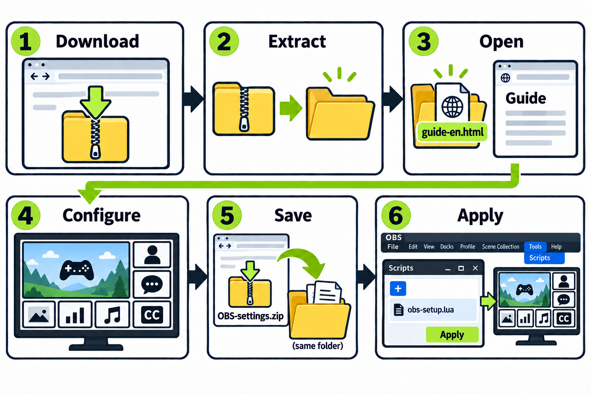
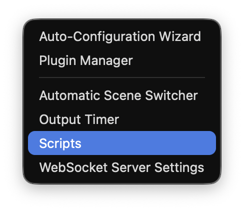
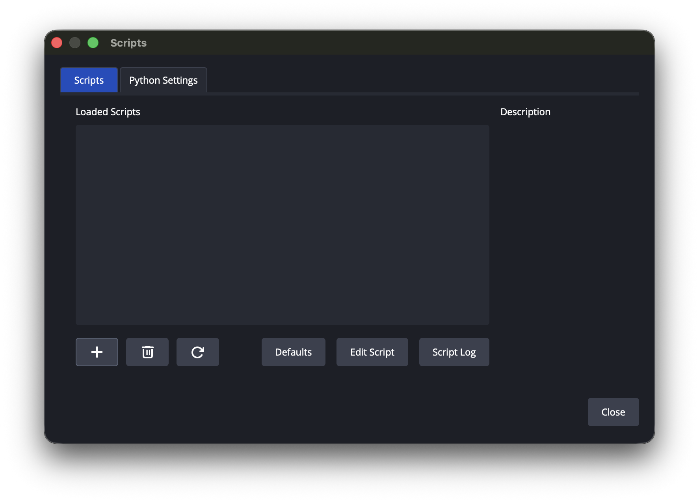

# OBS Streaming Template

Seven panels automatically arrange your game, camera, chat, and captions without covering each other.

<details>
<summary>Words explained: GitHub, README, OBS, ZIP, MIT</summary>

- **GitHub** hosts programs and their updates. No account is needed to download.
- **README** is this instruction page.
- **OBS Studio** is a free app for recording and broadcasting. This template arranges its sources.
- **ZIP** packs files into one download. **Extract** unpacks them into a folder.
- **[MIT license](https://opensource.org/license/mit)** permits using, modifying, and sharing this project's code, including commercially, with its copyright and license notice intact. It provides no warranty. Fonts and icons have separate terms.

</details>

## Get started

**[Download the template ZIP](https://github.com/kmg200164/OBS-streaming-template/raw/b72629ad4d29d5abfbaa96cecc39799abe4333ea/downloads/OBS-Streaming-Template.zip)**



1. Click the download link above. Find the ZIP in **Downloads**.
2. Use the download link above; GitHub’s **Code → Download ZIP** is for developers. Extract it: Windows **right-click → Extract All → Extract**; macOS **double-click**. Open the extracted folder. Do not open pages inside the ZIP.
3. Double-click **settings.html**, then its gear icon to open settings.
4. Configure Panels 1–7, then click **Save as ZIP** to download `OBS-settings.zip`.
5. Extract **OBS-settings.zip** into a new folder. Keep that folder; OBS uses its files.
6. In [OBS Studio](https://obsproject.com/) **30.1 or newer**, set the base canvas to **1920 × 1080**. Open **Tools → Scripts → +** and select `OBS-script.lua` from the folder you just extracted from **OBS-settings.zip**. Assign a distinct existing source to each panel using **OBS source**, then click **Apply saved settings / Auto layout**.

### OBS buttons

**Tools → Scripts**. The menu names are the same on Windows and macOS.



Click **+** at the bottom left to add `OBS-script.lua`.



Select the required sources, then click **Apply saved settings / Auto layout** on the right.

Keep the installation folder in place; OBS uses its files. English is the default language, with Korean and Japanese available.

**0.5.2 — test version.** Installation checks remain incomplete; see [QA results](docs/QA.md).

To update your layout, repeat steps 4–6. Each source can serve only one panel; scenes and groups cannot be selected. Seven camera panels require seven distinct sources. For Korean script controls, enable **English UI (reload after changing)** and reload.

Generated items are locked automatically. Applying settings does not start broadcasting, change stream keys, or alter capture-device settings. Content retains its aspect ratio; rounded masks leave original sources in other scenes unchanged.

## Layout and preview

Parent and child frames determine placement. Disabling panels redistributes the remaining space. Panel numbers appear only in the preview.

| Panel | x | y | Width | Height |
| --- | ---: | ---: | ---: | ---: |
| 1 | 32 | 32 | 1384 | 778 |
| 2 | 32 | 842 | 440 | 206 |
| 3 | 504 | 842 | 440 | 206 |
| 4 | 976 | 842 | 440 | 206 |
| 5 | 1448 | 32 | 440 | 317 |
| 6 | 1448 | 381 | 440 | 317 |
| 7 | 1448 | 730 | 440 | 318 |

Default coordinates adjust with configuration. Background, fill, content, and outside stroke are independent layers. Defaults: black background; white fill at 20% opacity with 32px blur; opaque white 4px stroke. Hiding the stroke preserves content and fill.

**Show sample** displays your test message; **Clear sample** removes it without resetting settings. Leave **Fullscreen view** with `Esc` or the return button. Check live widgets in OBS; preview samples do not verify connections.

## Content and services

Choose OBS sources in the script. For web content, use a provider's HTTP(S) display/widget URL. Management and video watch pages do not become widgets or playable media automatically.

Any panel supports compatible chat, translation, alerts, donations, or reactive images. Providers control their widgets' typography, timestamps, names, audio, and connections. Keep required services running;

Upload images, GIF, MP4, or WebM, or use direct media URLs. Uploads are processed locally. Media loops muted; widget audio follows provider settings. Use assets you have permission to share.

## Settings and privacy

Keep personal `config.js`, `obs-settings.json`, and `OBS-settings.zip` private: they may contain widget tokens. Public builds use neutral defaults from `template/config.public.js` and an explicit file allowlist, excluding private settings and original artwork.

Browser drafts do not update OBS; apply exported settings through steps 5–6. Exports override older drafts; Reset restores defaults. Keep uploaded assets with their settings, and reselect missing files before exporting again.

## Windows and macOS

Source downloads use `template/`; built packages use `streaming-template/`. Both keep settings beside the Lua file, with paths relative to that folder.

Capture permissions and available sources vary by OS. macOS verification is partial. Browsers may restrict local content; HTTP preview does not prove direct-file compatibility. For development, run the server below and open `http://127.0.0.1:8873/template/settings.html`.

## Development

```sh
node --test tests/*.test.cjs
python -m unittest discover -s tests -p test_build.py
python build.py
python -m http.server 8873 --bind 127.0.0.1
```

Use `python3` or Windows `py` where needed. Tests require Node's built-in runner and Python's standard library. Build validation checks references, ZIP contents, and CRC before replacing `dist/OBS-Streaming-Template.zip`; failures preserve the previous package.

Work on `dev`; review and test before merging into `main`, which holds verified snapshots.

The `layoutVersion 4` schema maps `game`, `custom1`, `custom2`, `custom3`, `chat`, `translation`, and `hand` to Panels 1–7. These internal names do not limit roles. Each `panelContent` entry contains `{type, url}`; types are `none`, `source`, `web`, or `media`.

### Files

- `template/`: runtime pages, scripts, styles, and assets.
- `tests/`: regression checks.
- `docs/QA.md`: verification evidence and remaining checks.
- `build.py`: neutral package builder.
- README, CHANGELOG, LICENSE: documentation.

## Credits

KMG directs the product, design, and requirements, and evaluates real use. Code was implemented with **OpenAI Codex** through **vibe coding**.

<details>
<summary>Codex and vibe coding explained</summary>

**[Codex](https://openai.com/codex/)** is an AI coding assistant that writes, changes, and tests code from everyday instructions.

**Vibe coding** means describing a desired result to AI and refining its output. Human review and installation and broadcasting tests are still necessary.

</details>

## License and feedback

Code: [MIT](LICENSE), copyright 2026 KMG. Figma Simple Design System icons (CC BY 4.0), Lucide (ISC), and Inter (OFL) retain their own terms; see [third-party notices](template/assets/THIRD-PARTY-NOTICES.md).

Report problems through GitHub Issues with the version, platform, reproduction steps, and result. Remove private URLs and tokens from attachments. Updates appear in [CHANGELOG.md](CHANGELOG.md).

## Versions

Use `MAJOR.MINOR.PATCH`, without development suffixes. The UI and tags add `v`; `dev` names the branch.

`template/version.js` supplies the UI and package version. During `0.x`, fixes increment PATCH and features increment MINOR. Released versions are never replaced; changes receive a new number.

## Support

This template is free. If it helps you, you can [support this project](https://buymeacoffee.com/kmg200164). Support is optional and helps fund continued improvements.

<p align="center">
  <a href="https://buymeacoffee.com/kmg200164">
    
  </a>
</p>