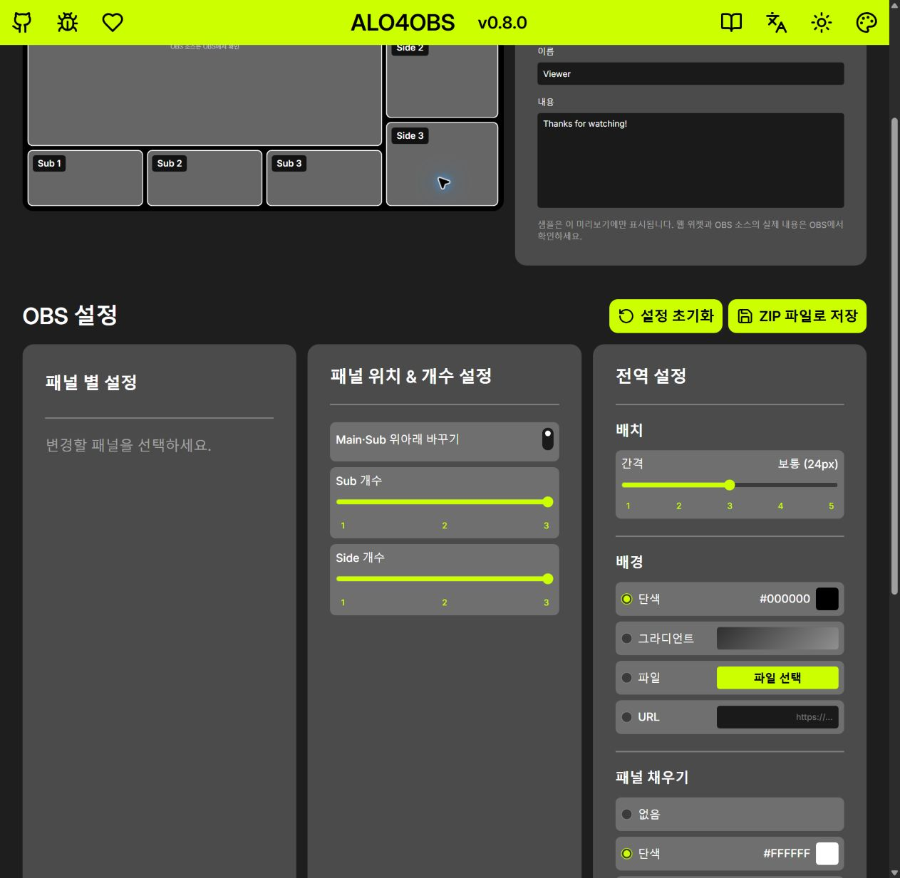
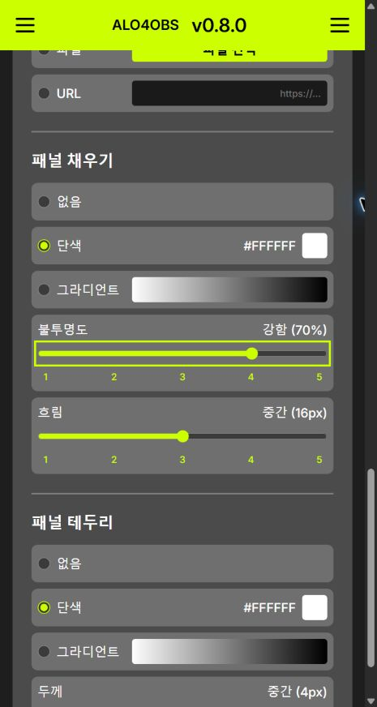
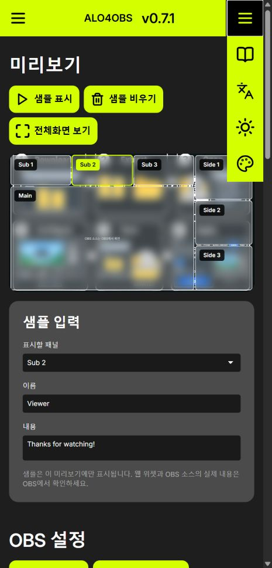
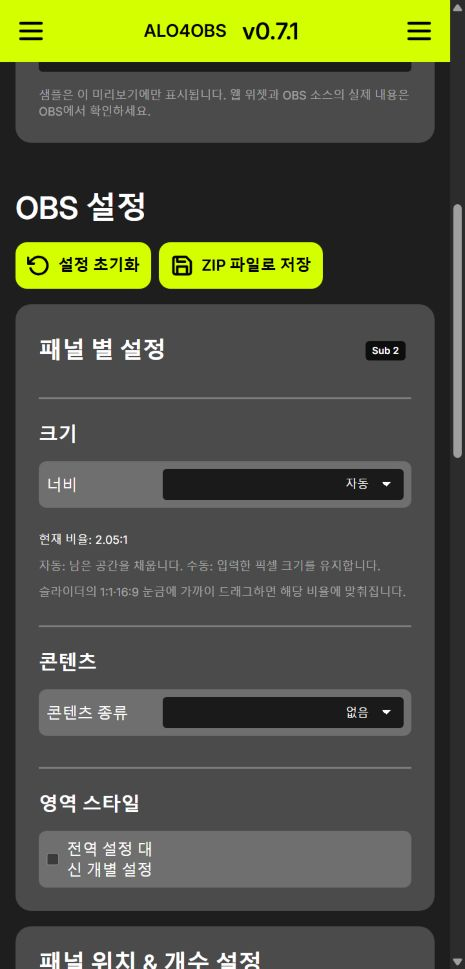
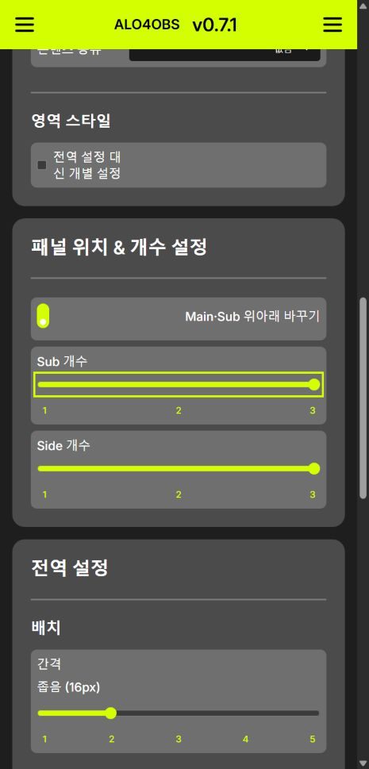
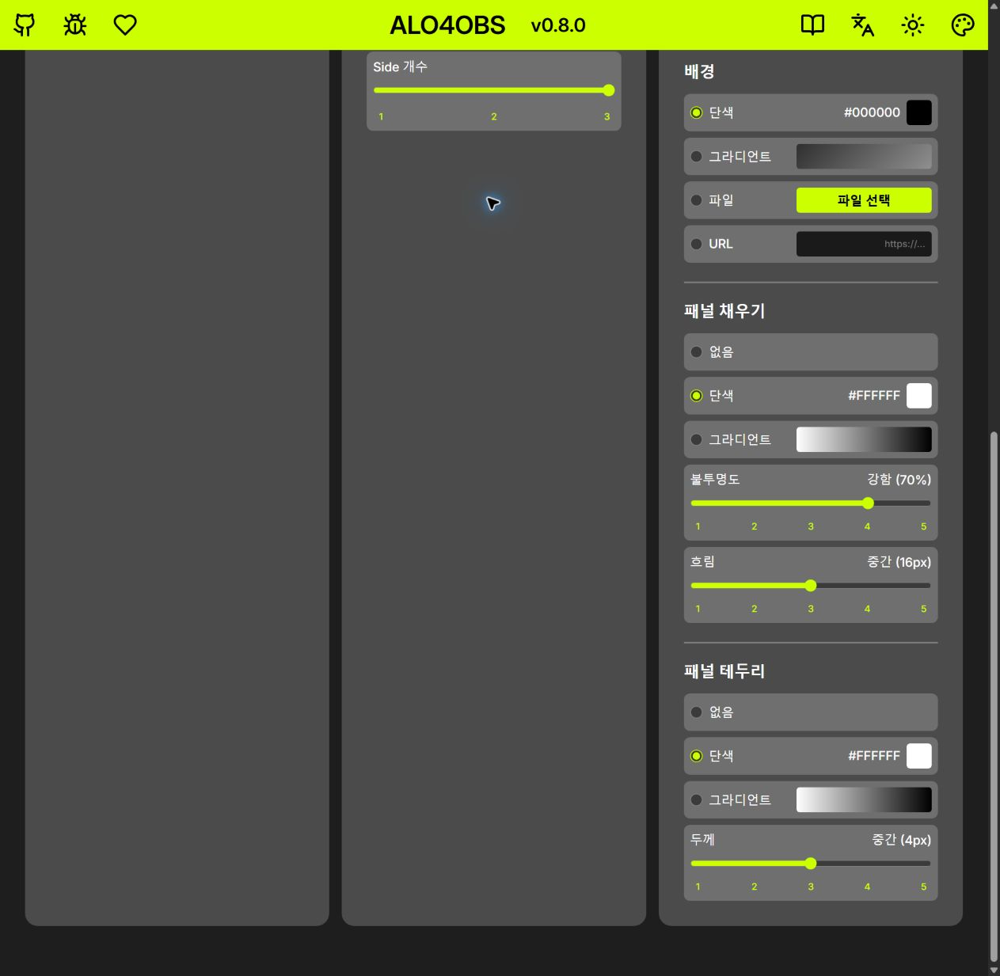

# ALO4OBS 0.8.0 preparation report

2026-10-06–07. Working folder: W:/Project/OBS-streaming-template. Baseline dev / 3b44626. Existing 0.8.0 handoff changes included. Source version is 0.8.0. Commit and push to dev authorized on 2026-10-07; no tag, GitHub Release or repository rename.

## 0. Models and effort

| Work | Model | Effort |
|---|---|---|
| Panel-count implementation and later header implementation | GPT-6.1 Sol | high, existing agent reused |
| Global sliders, vertical switch, tag and selector alignment | GPT-5.6 Terra | medium |
| Structure/storage audit, documentation, independent code review | GPT-5.6 Terra | medium |
| Independent final header code review | GPT-6.1 Sol | high, separate reviewer |
| Integration and rendered browser review | GPT-6.1 Sol | low after the user's model change |

Existing implementation agents were reused. One bounded high-effort reviewer was added after the user requested stronger independent review.

## 1. Changed files in this session

- UI: template/preview.js, preview.css, settings.html, header.js, header.css, i18n.js.
- Guides: template/guide.html, guide-en.html, guide-ja.html. The shared guide-layout script was already dirty and was preserved.
- Docs: README.md, CHANGELOG.md, template/README.txt, template/assets/THIRD-PARTY-NOTICES.md, docs/QA.md, docs/release-notes-0.8.0.md and this report.
- Checks: tests/panel-count.test.cjs, global-preset-sliders.test.cjs, panel-gap-recommendation.test.cjs, header.test.cjs; existing i18n, panel-sizing-ui and generic-panels checks adjusted for the new controls.
- Earlier handoff changes in build.py, Lua, events, overlay, pack and their tests remain in the working tree. They are not attributed to this session.

The size selector mismatch came from the size-row CSS overriding shared row geometry. That exception was replaced with the shared label-width token, padding, gap and full-width select rule. Narrow headings retain a horizontal title/tag row.

## 2. Build and test comparison

| Evidence | Node | Python | Build |
|---|---:|---:|---|
| Earlier handoff baseline | 152 | 8 | passed |
| Verified session start | 169 | 11 | passed |
| Final integration | 189 | 11 | passed (47 files, version 0.8.0) |

Commands: `node --test (Get-ChildItem tests\*.test.cjs).FullName`, `python -m pytest tests -q`, `python build.py`.
Source version is now 0.8.0 at the user's request. Output is dist/ALO4OBS-v0.8.0.zip, a local prerelease package; the pinned public download remains unchanged.

## 3. README

150 lines at handoff → 95 lines. Removed repeated sizing details, overlapping installation/button sections and service prose. Retained the exact pinned 0.7.1 download, a four-step install, explicit destructive OBS update instructions, same-version rollback limit, privacy, FAQ, licenses, credits and known platform limits. Upcoming notes clearly distinguish unreleased 0.8.0 from the downloadable package.

## 4. Release body draft

The complete Markdown body is in [release-notes-0.8.0.md](release-notes-0.8.0.md). README release notes must be replaced for the eventual approved release, and the same notes copied into the Release body. Nothing has been published.

## 5. Uploaded-file persistence

HTTP Chrome: upload → close/reopen tab → selected path restored → decoded image rendered, passed. IndexedDB obs-overlay-uploads and localStorage obs-overlay-config remain unchanged. Automated checks cover quota failure, incomplete bytes, snapshot export and concurrent/stale saves.

Not verified: full browser-process exit/restart, file:// storage, OBS browser-source storage/language, actual quota UI and the complete local-upload ZIP-to-OBS path. Native app control is unavailable in this session. A tab reopen is not substituted for a full restart.

## 6. Structure audit — proposals only

- events.js is the coordinate authority. overlay uses those positions on a fixed 1920×1080 absolute canvas; that is appropriate here. Its obsolete flex declarations deserve a clarification/removal after compatibility review.
- Lua's old boxes table is still used by legacy v2/v3 paths; v4 reads exported positions. Do not remove it without deciding legacy support.
- Header black ink is intentionally independent of theme text. First consolidate header-specific tokens, then icon rules, preview radii, overlay radii and layout comments. No broad refactor was performed.
- Audit snapshot literal counts before subsequent UI edits: preview.css 27 hex / 19 radius declarations / 206 px; overlay.css 19 / 6 / 76; header.css 10 / 3 / 34. These are audit observations, not final linter counts.
- All UI SVGs now use official Lucide 0.468.0 stock glyphs with viewBox 24 and stroke 2. ISC and Feather MIT notices are included.

Decisions still needed: retain old OBS Template · / KMG · recognition; replace old product wording in script descriptions/logs. English Main/Sub/Side are intentional shared role names. The requested gap slider is now implemented. The pre-existing vault .claude/launch.json preview server entry was not changed here.

## 7. Rendered evidence

Wide and 920/480 px responsive checks preserve the actual browser window size. Evidence images are retained in docs/images/qa-0.8.0/. Header menus, selected tag, matching selectors, sliders and vertical swap are checked in the rendered page. This is HTTP UI evidence only.

## 8. Remaining boundaries

No release-readiness claim until the storage/native/platform items above are tested. Actual native confirmation acceptance/cancel was interrupted by the browser connector; only dialog appearance, no prompt on restore and automated behavior are established. Existing work was backed up before this session; the review backup is retained outside the repository.

Final rendered header: 1278 px viewport brand center 631.328 px / header center 631.333 px; 360 px viewport both centers 172.333 px. Menus start closed at 920/480/360, open mutually exclusively, close with Escape, and settings/guide navigation works. Actual outer window stayed 1293×1398. Independent high review found no confirmed defect in the three reviewed header files; historical diff comparison was unavailable to that reviewer, while root verified working-tree status and diff checks.

Temporary QA server 8767 stopped. Two unconnected QA tabs could not be closed through the browser connector; cleanup is not claimed complete. Preview server 8765 and requested live status server 8766 remain. That initial 8765 connection failed; the final controllable Chrome 8765 tab was refreshed and verified on 2026-10-07.

## 2026-10-07 correction and live slider verification

The earlier rendered checks used temporary origin 8767. The user's 8765 tab retained unversioned cached CSS, so those checks did not establish delivery to that tab. Relevant CSS/JavaScript references now carry a version query, and source version is 0.8.0. No public release has been created.

Actual Chrome 8765 input checks now pass all five positions for opacity (10/20/40/70/100%), blur (4/8/16/32/64px), and stroke width (1/2/4/6/8px), with labels updating on input. Preview surface opacity changes from 0.1 to 1 and backdrop filter from blur(4px) to blur(64px); the current solid background hides the backdrop visually. Reload restores the selected middle values. Regional preset ordering is unchanged.

At the actual wide viewport, count/global ranges span 308.89px inside 324.89px cards, leaving only 8px padding per side. The swap control uses native switch semantics with CSS appearance:none. A new rendered screenshot records the live maximum blur label.

Final integration: Node 189/189, Python 11/11, verified 0.8.0 ZIP with 47 files. Independent high review passed icon, slider, locale and final alignment changes. Chrome 8765 now shows name left/value right/full-width track and Main/Sub text left/vertical switch right; 480px viewport has no horizontal overflow. Original test settings and viewport were restored. All UI icons are official Lucide 0.468.0 stock. Gradient backdrop activation and blur(64px) were checked before restoring the solid background.
Header follow-up: at 1200px and wider, the centered brand displays Auto Layout Overlay for OBS; narrower viewports display ALO4OBS. CSS alone controls the visible text. Actual Chrome 1278px and 480px checks passed without horizontal overflow; focused header/icon tests 8/8 passed. Window viewport override was reset.
2026-10-07 publication: user authorized the main update and repository rename. Repository is kmg200164/ALO4OBS. downloads/OBS-Streaming-Template.zip contains verified 0.8.0; README pins its package commit. Earlier unreleased statements describe preparation history. Native/platform QA boundaries still apply.
