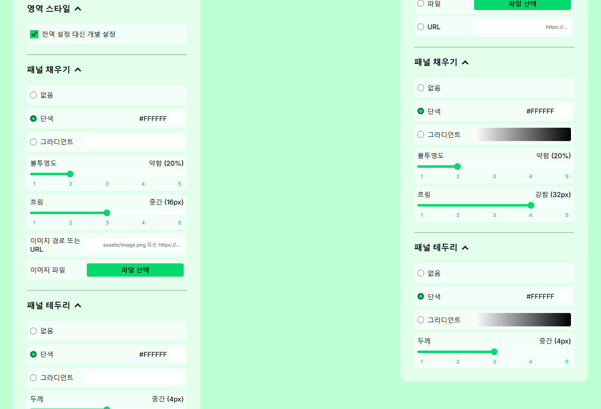
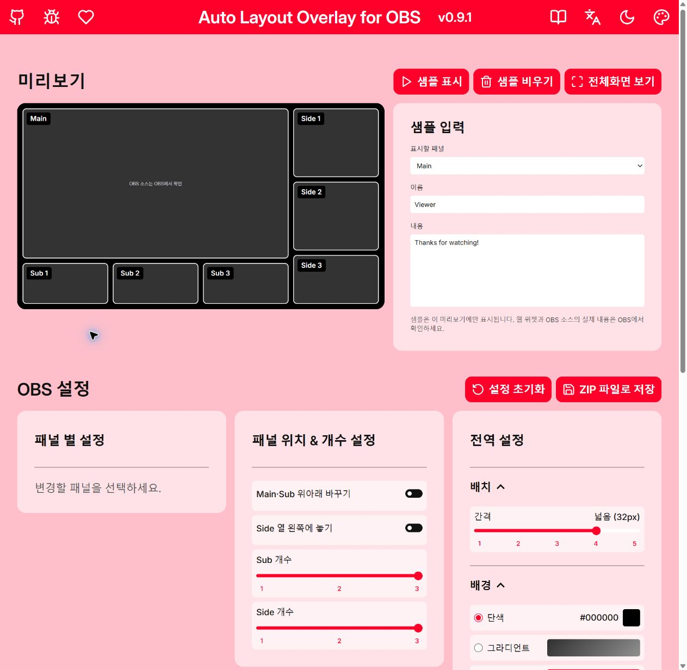
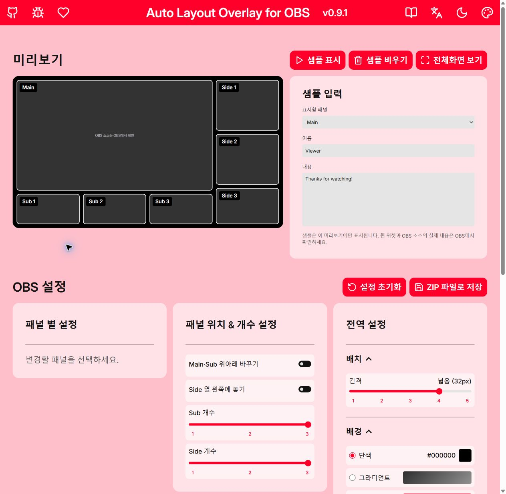
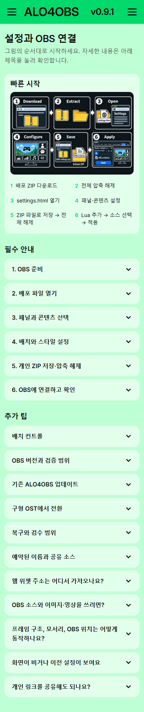
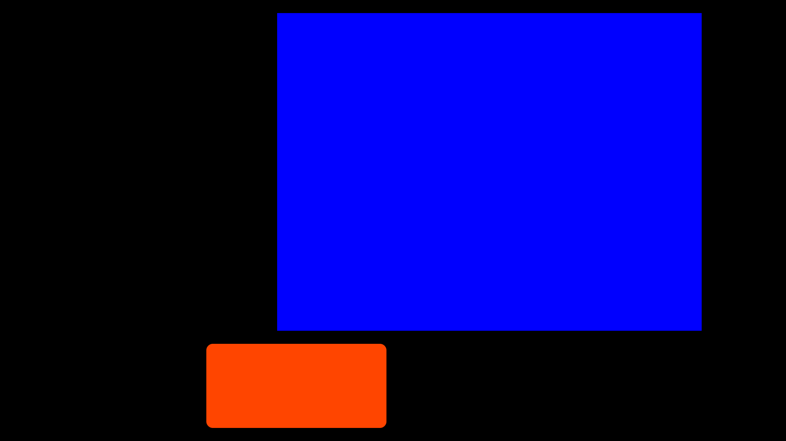

# ALO4OBS 0.9.1 local patch report

Date: 2026-10-08 (Windows). Base: `8e7abad5bafc7824b1e2cb404416341dc72ee1a6`, main. The worktree was clean at intake. This report records local preparation, not publication. No commit, push, tag, Release, broadcast or external message was performed.

## Scope and status

| Session requirement | Status | Change/evidence |
|---|---|---|
| Deferred README rewrite and concept comments | Complete | Actual 11-step workflow; WHY comments for source mapping, runtime folder dependency, guarded snapshot and exported JSON |
| Deferred individual Region style parity | Complete | Same five-step opacity/blur/width sliders, strength labels, chevrons, section spacing; image fields inside Fill; saved values and gradients preserved |
| First install / current ALO update / legacy OST coexistence | Complete | Separate instructions; no blanket scene/source deletion; `ALO ·` / `ALO4OBS` verified against Lua |
| Safe current update | Verified for bounded fixture | Old applied config.js + referenced PNG restored in new editor; personal JSON and PNG bytes identical; native scene/source checks below |
| Rollback guidance | Corrected, execution pending | ALO reuses its scene and changes runtime paths: old Lua alone cannot roll back. Import old scene-collection backup as a separate recovery collection; keep matched old folder/Lua. Switching to the retained old scene applies only to separate OST coexistence |
| Distribution vs personal ZIP / browser vs OBS | Complete | Whole-folder dependencies and explicit export, reload, source reselection and Apply documented |
| README / bundled README / KO-EN-JA guides / CHANGELOG | Complete | Three guides lead with the reused six-step infographic, six closed required groups and eleven closed extra tips; the complete eleven-step procedure remains available, including the actual Japanese `ZIP で保存` button |
| Follow-up section surfaces / slider rails / override separation | Complete | Light sections use 55% white and dark sections 35% black; all range families use a borderless 6px rail / 16px thumb in the existing 24px control, retain keyboard focus and track progress; override gets a divider and 24px spacing |
| Follow-up guide presentation / hover | Complete | Setup infographic first; required information and extra tips closed; entire card uses the accent on hover/focus; nested file/button highlights invert with readable ink |
| Later approved Cherry/Bubblegum white accent ink | Complete with measured limitation | Light-mode accent text/icons use white; accent and page HEX values retained. Small-text contrast: Cherry 3.972:1, Bubblegum 3.380:1, below 4.5:1; explicit exceptions are measured and reported, not labelled WCAG compliant |
| Later approved pure selection/text fields | Complete | Shared field surface is #FFFFFF in light mode and #000000 in dark mode; actual Chrome checked sample select/input/textarea in both modes with window size preserved |
| Version and packaging | Complete locally | One correction/documentation patch, 0.9.1; root settings.html opens files/settings.html; runtime cache keys use 0.9.1 |
| Old work-report SHA correction | Complete | Actual immutable 0.9.0 archive rehashed below |
| Commit / push / tag / Release / distribution | Awaiting separate approval | No Git publication operations performed |

Previously accepted 0.9.0 work was retained rather than recreated: twenty approved theme/mode combinations, accent guide highlights, top warning placement, translucent cards, dividers, keyboard-only button focus, borderless form geometry, high-contrast switches, closer accent slider labels, outer accent panel hover/selection, selection-field internal arrow padding and Lucide icon, full-card guide FAQ interaction, dynamic cards/section chevrons, ratio snap labels and Sub minimum rules, and narrow-screen brand/action dimensions. Existing regression tests cover these paths; the follow-up corrects shared glass/slider/guide interaction styles without changing approved accent/page values; later Cherry/Bubblegum light-mode ink overrides are listed above or the layoutVersion 4 export format.

## Changed files

- README.md, template/README.txt, template/guide.html, guide-en.html, guide-ja.html: synchronized setup, update, migration, rollback and verified environment scope.
- template/preview.js and preview.css: reuse existing global range/section helpers for regional controls; preserve numeric config keys. Region image fields belong to Fill. Shared range progress and borderless paint cover counts, size and style sliders; the override separator hides with the disabled controls.
- template/header.css: correct mode-specific glass surfaces and increase their opacity; apply pure-white/pure-black field surfaces and the two requested light-mode accent ink overrides. template/guide-layout.css: progressive guide captions, mode-independent accent hover and inverted inline highlights. template/assets/setup-workflow.png: byte-identical reuse of the existing approved documentation image.
- template/OBS-script.lua and pack.js: short conceptual WHY comments and current product wording. No Lua apply algorithm or source-selection behavior was changed.
- template/version.js, template/settings.html: 0.9.1 version and cache references.
- build.py and tests/test_build.py: distribution launcher goes directly to the editor; guide infographic is included in the distribution only, excluded from the personal OBS runtime. This avoids adding an unused image to each personal settings ZIP.
- tests/regional-style-ui.test.cjs: strength mapping/export, gradient/media preservation and rendered global/regional parity. tests/panel-sizing-ui.test.cjs: existing heading assertions updated. tests/guide-progressive.test.cjs and tests/theme.test.cjs: collapsed workflow, whole-card behavior, mode surfaces and accent/inverse nested-highlight rendering.
- CHANGELOG.md, docs/work-report-0.9.0.md, docs/QA.md and this report: correction record and separated evidence.
- downloads/ALO4OBS-v0.9.1.zip and docs/images/qa-0.9.1/: neutral local distribution and synthetic visual evidence. Private QA fixtures/logs are excluded by .gitignore.

## Automated and browser evidence

- `node --test tests/*.test.cjs`: 217 passed, three opt-in render tests skipped without the render URL.
- `KMG_THEME_RENDER_URL=http://127.0.0.1:8772/.qa-private/0.9.1/review-distribution/files/ node --test --test-concurrency=1 tests/*.test.cjs`: **221 passed, zero failures/skips** against the extracted candidate. Includes 20 theme combinations/settings and all three guides, 320–1200px dimensions and regional/global rendered controls.
- An earlier parallel opt-in run timed out once waiting for a regional panel (216 passed, one failed). The regional test passed alone; the complete serialized run above passed. The intermittent timeout cause was not established; serial execution avoided it in the final run, but does not establish every possible browser timing.
- `python -m unittest discover -s tests -p 'test_*.py'`: **13 passed**, including installed LuaJIT against mocked OBS state for failure rollback and side placement. Mocked rollback is separate from native success checks.
- `python build.py`: allowlist, full generated entry byte parity, neutral defaults and ZIP CRC passed; dist/download candidate bytes match. 48 generated files plus root launcher = **49 archive entries**. README, transformed guides, CHANGELOG and version match the current builder inputs.
- Local documentation/assets: **14 Markdown references resolved**; distribution HTML/CSS/script/asset links also passed builder validation; each guide preserves the complete setup inside **six required groups**, with **eleven extra tips**. The guide infographic matches the existing documentation image byte-for-byte. Five principal external links returned HTTP 200. The OpenAI link returned 403 to the script client but opened successfully through the web reader. No links were published or messages sent.
- Isolated Chrome HTTP context: 0.9.0 uploaded PNG + per-panel override (70% opacity/8px blur), Main OBS source choice and Side-left placement saved/reopened/exported. The old applied config.js and only its referenced PNG were copied to the new distribution; ten settings groups, full exported JSON and PNG bytes remained identical after new save/reopen/export.
- Additional isolated Chrome guide review: three languages at 320, 390, 760 and 1440px (**12 cases**) passed image loading, six required/eleven extra sections initially closed, no horizontal overflow, Enter/Space and whole-card body toggling.
- Actual connected Chrome opened the final extracted 0.9.1 candidate; light section tint, override divider and slider outline removal were visually checked. Guide hover uses the current accent; actual Chrome verified Cherry light-mode white header/card ink and white-backed red filename highlights. Automated rendering covers both modes and all presets, including Bubblegum white ink. No user browser window was resized. A single review tab and loopback-only HTTP server remain for review.

## Native Windows OBS evidence

These native checks ran earlier in this patch session, before the final editor-only surface/slider/guide follow-up. They verify the bounded update and OBS Apply workflow, not a new native run of the final ZIP bytes. The follow-up does not change the Lua Apply algorithm or OBS configuration schema.

Installed OBS **32.2.2** was copied to a separate portable diagnostic folder, with a fresh **1920 x 1080 QA profile and scene collection**. User scenes/settings were not imported into it. A Lua timer harness invoked the real script properties Apply button through actual OBS APIs, not the mocked tests. No streaming, recording, physical camera/capture or personal widget was enabled.

1. Old 0.9.0 personal ZIP: **9 assertions passed**. A synthetic original color source and its user color filter survived, another scene's item stayed at (51,73), the legacy scene/OST group stayed intact, ALO4OBS was created, config.js generated, and reapply retained source settings.
2. New 0.9.1 personal ZIP after editor migration/restart: **14 assertions passed**. Original source/filter and other-scene transform remained; old OST scene/group remained; ALO4OBS reused; Main source mapping reselected; repeated Apply kept six top-level items without duplicates; media local_file pointed at the new runtime; uploaded PNG existed.
3. Actual OBS output screenshot showed the synthetic blue original and orange uploaded PNG in their allocated areas. This verifies a local-uploaded-image ZIP-to-OBS path; it does not verify video or live captures.
4. User OBS configuration hashes: **25 files unchanged, zero additions** after the isolated tests. Original OBS production environment was not mutated.

The harness could not call `obs_frontend_exit` (not exposed by the installed Lua binding); the first successful report was followed by this diagnostic teardown error. The controller stopped only the verified copied QA process after scene saving. The second harness used controller teardown without that call. This is not a product Apply failure. Private checks, synthetic scene snapshot and logs are retained; the copied 488 MB OBS binaries are removed after testing.

## Package integrity

- Existing public `downloads/ALO4OBS-v0.9.0.zip`: **955,839 bytes**, SHA-256 `3328e0bdfd73a85b85945834a377a09622056b815d3ad9e9667061de43827da0`. The file was not rebuilt/replaced; only its malformed historical report line was corrected.
- Local candidate `downloads/ALO4OBS-v0.9.1.zip`: **2,425,643 bytes**, SHA-256 `05a481e9068981bd38c04922d118838d24debed07f8e90536f83aa563cb1ef18`. It contains neutral defaults, licenses and the approved distribution allowlist; the guide infographic is omitted from the personal OBS runtime. It excludes diagnostic media, personal settings and source selector mappings.

## Remaining verification and approval

- Human review: section opacity, individual/global Fill/Stroke parity, guide progressive presentation and accent/inverse-highlight hover, documentation's three install/update routes, and actual original camera/capture/widget content in a backed-up/separate OBS collection.
- Not executed: direct file:// settings-editor startup/upload/export, Windows Explorer extraction/file-picker flow and Mark-of-the-Web behavior, physical cameras, real game/window capture, personal/provider widgets, video upload-to-OBS, actual failure rollback for 0.9.1, exhaustive browser storage limits, Firefox/WebKit runtime and assistive-technology/forced-color rendering, macOS, or OBS versions other than 32.2.2. OBS 30.1 is an API minimum, not a tested support matrix.
- Legacy coexistence tested with a synthetic retained OST scene/group; arbitrary historical OST exports/old Lua versions were not automatically migrated or exhaustively tested.
- Local patch is reviewable for a separately approved commit/push. Publishing a Release or claiming all environments supported requires its own approval and corresponding verification. The public README download stays on 0.9.0 until publication is authorized.

- Preview alignment follow-up: hit-area dimensions now share the iframe uniform scale. All seven panel boundaries remain within 0.06 CSS pixels across 390, 760, 969, 1278 and 1440px widths after resizing without reapplying settings. Chrome review screenshot: `images/qa-0.9.1/hover-alignment.jpg`. This editor-only fix was not retested in native OBS.

Publication preparation: user approved main commit/push after review. Download and bundled guide references now target 0.9.1; the original 0.9.0 archive remains unchanged. Remote main English documentation changes were retained. Tags and GitHub Release are outside this approval.
